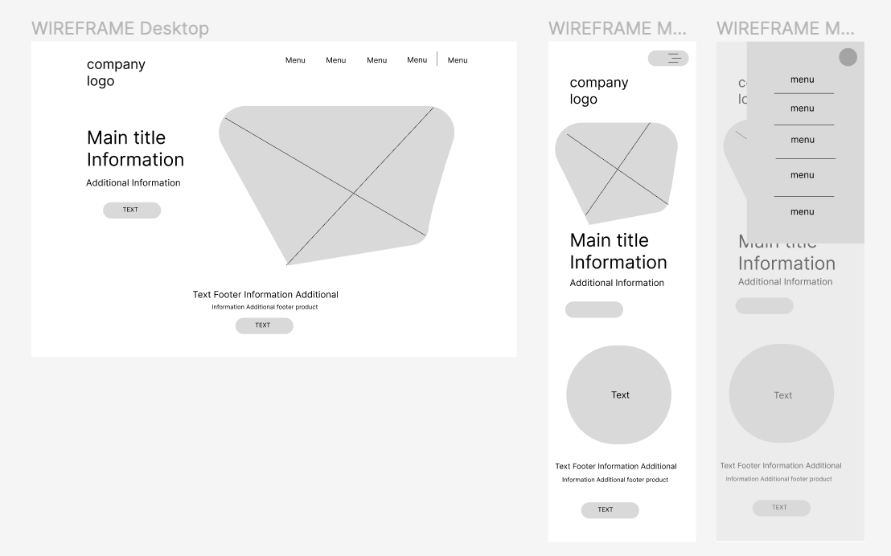
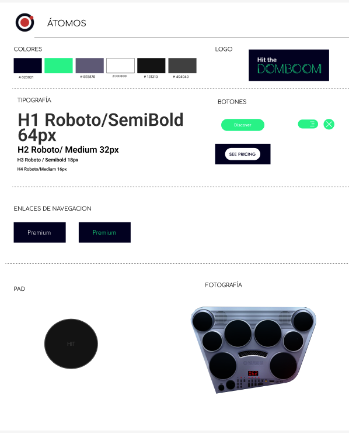
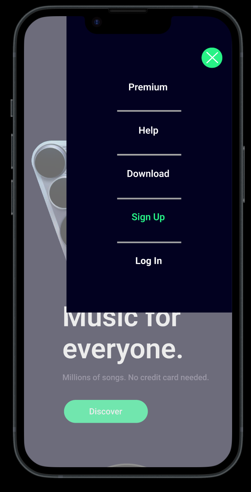

# HitDOMboom Proyecto Factoria F5

## Contexto del proyecto
Un cliente ha solicitado el desarrollo de una landing page para su empresa de instrumentos musicales, planea vender su producto estrella una batería electrónica (drumkit)
Como desarrolladoras web de front-end, el objetivo es hacer una replica del diseño de la landing page propuesto por el cliente con la prioridad que el usuario pueda interactuar con el drumkit, de tal forma que cuando da click en cada uno de los “pad” se emita un sonido distinto. Tiene que poder funcionar en cualquier dispositivo y adaptarse. Se deberá usar HTML5, CSS3 y Javascript, con una maqueta y prototipo en Figma.

## Figma
### WireFrame

### Atomos

### Moleculas

### Organismos

### Version Desktop

### Version Mobile

## Navegador
### Desktop

### Movil

